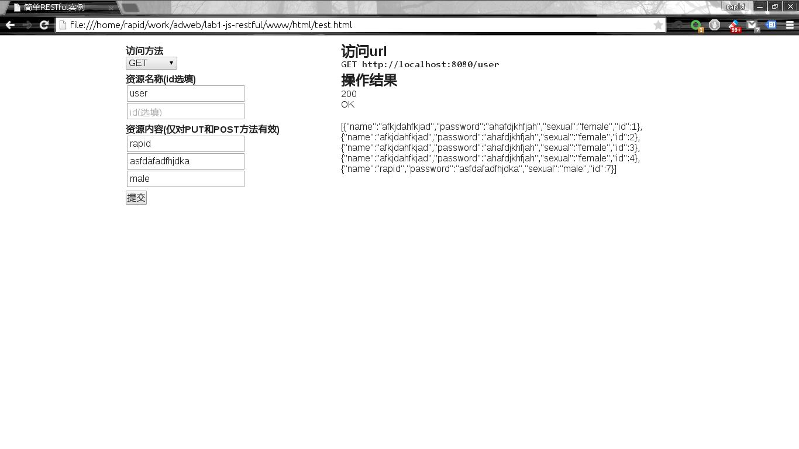
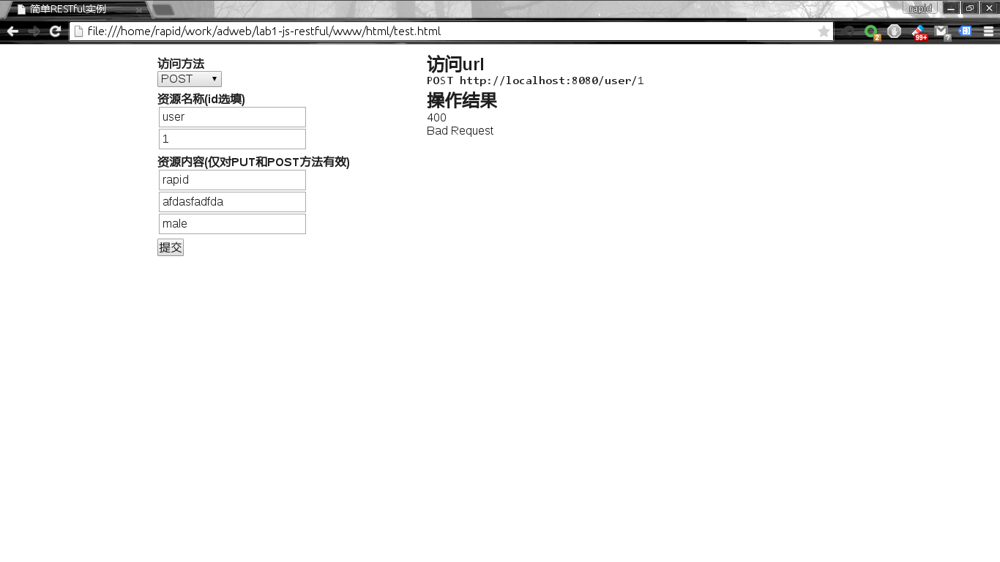
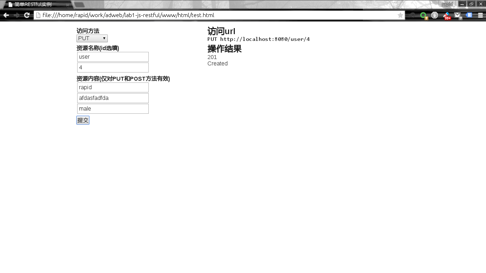
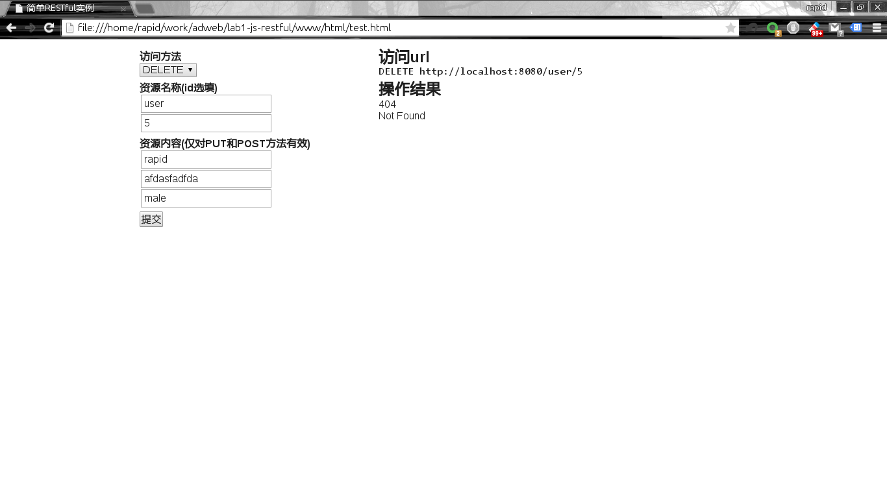

一个简单的自制的NODE RESTful实例
===

> FDU Advacned Web Class Lab1
>
> Author: rapidhere@gmail.com 董奇 13302010078

简单说明
--

在网上查阅了很多资料以后，感觉现有的Node的RESTful框架其实很多，但是大多数是和express以及Mongoose集成的。

作为一个轻量级的lab，我决定自己实现一个简单的RESTful框架，以及一个简单的实例。虽然这个框架目前很不完善，但是还是觉得有很大的收获。

lab内容
---

* package.json: node的包文件，包含一些依赖
* index.js: RESTful服务器启动脚本
* core: 框架核心
* data: 一些实例数据
* README.md: 本说明文件
* www: 实例的代码
* screenshots: 一些运行时截屏

运行
---

1. 需求Node和npm

2. 运行前首先在项目目录下运行`npm install`安装依赖

3. 运行`node index.js`，一个简单的web服务器将运行在8080端口上

4. 在浏览器中运行`www/html/test.html`，打开一个简单的测试页面，进行手动测试

运行时截图
---

一些问题
---

这个框架问题很多。首先其架构设计有问题。由于设计的时候参考了node-restful的设计，导致了一些错误的想法，比如每个操作都应该是依附于一个collection，这导致了设计中的狠多问题。

同时，有些语义应该是框架级别的，但是因为设计失误，最后只能在应用程序中实现，比如POST的url不应该带有id

没有实现filter

不支持子模型访问，也就是`/zoos/1/animals/23`这样形式的url

以及其他
